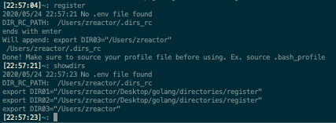

# Register Directories

A simple tool for registering the current pwd to a .dirs_rc aliases file so as to easily jump to it later.



## Usage

0) Setup/install

```bash
cd showdirs && go install
cd register && go install
```

1) Make a .dirs_rc file and set your .bash_profile, etc profile file to use it to load the directory alias names.

To load your .dirs_rc, add to the top of your .bash_profile:

```bash
. .dirs_rc
```

2) Set envvar `DIR_RC_PATH` with the location of your .dirs_rc file.

Add to your .bash_profile etc. other profile file, use absolute path:

```bash
export DIR_RC_PATH="/Users/[path]/.dirs_rc"
```

Alternatively you can set this in the .env file, or as a CLI arg when registering your directory:

```bash
register -rcdir=/Users/somewhere/.dirs_rc 
```

3) When you are in a directory whose path you want to remember:

```bash
register
```

This will register the directory with the next alias number.

If setting dir_rc file directory via CLI flag:

```bash
register -rcdir=/Users/somewhere/.dirs_rc
register -rcdir /Users/somewhere/.dirs_rc
```

Reload your session via preferred method.

Ex.

```bash
source .bash_profile
```

4) Show your registered aliases:

```
showdirs
```

5) Use the registered alias to cd to directory, etc.

```
cd $DIR5
```